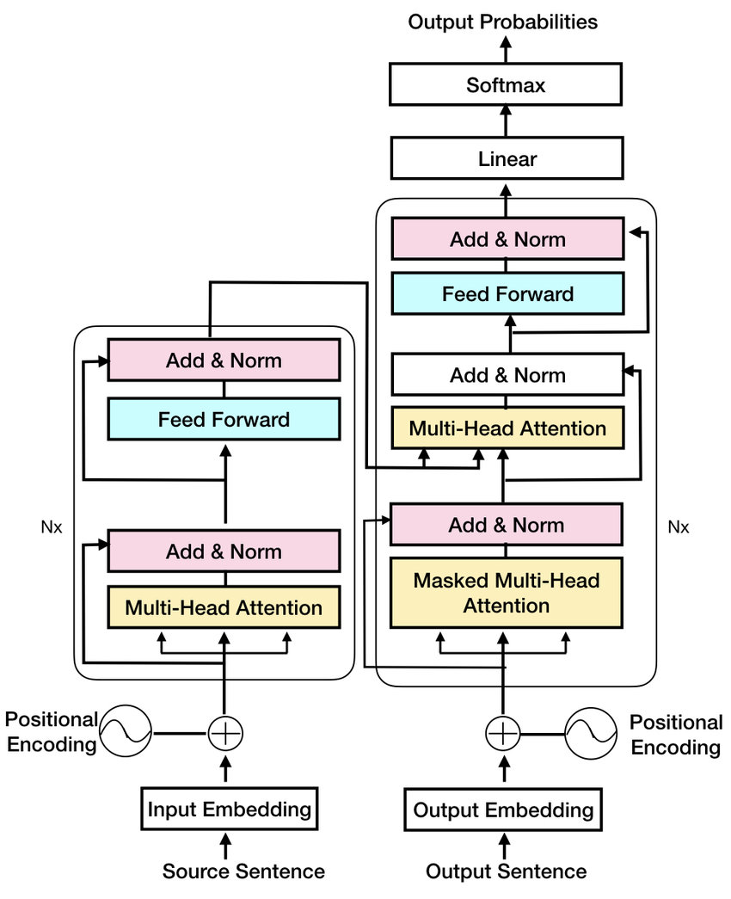

# Berufekonverter

Dieser kleine Konverter basiert auf der Transformer Architektur und wandelt eine männliche Berufsbezeichnung in eine weibliche um.
| Input | Output |
| ----- | ------ |
| Lehrer | Lehrerin |
| Arzt | Ärztin |
| Pädagoge | Pädagogin |
| Stadtrat | Stadträtin |
| Pflichtassistent (ärztlicher) | Pflichtassistentin (ärztliche) |
| Fachkraft | Fachkraft |
| Beamter | Beamtin |
| Mosaikpflasterer | Mosaikpflasterin |
| Kaufmann | Kauffrau |
| Ordensbruder | Ordensschwester |
| Obstbauer | Obstbäuerin |
| Versetzer (Bergmann) | Versetzerin (Bergfrau) |
| Katograh nicht wissenschaftlich | Katographin nicht wissenschaftlich |
| Mechaniker (Hubschrauber) | Mechanikerin (Haubschrauber) |
| Technischer Hohlglasmacher | Technische Hohlglasmacherin |
| Experimenteller Künstler | Experimentelle Künstlerin |

Die Architektur des neuronalen Netzwerkes ist ein Transformer mit Encoder/Decoder. Jeder Buchstabe ist ein Token (im Gegensatz zu den LLMs, bei denen jedes Wort ein Token darstelllt).

```
Parameter:
n = 128 (Anzahl Kanäle)
nh = 4 (Anzahl Attentionheads)
Nx = 3 (Anzahl Encoder-/Decodereinheiten)
```